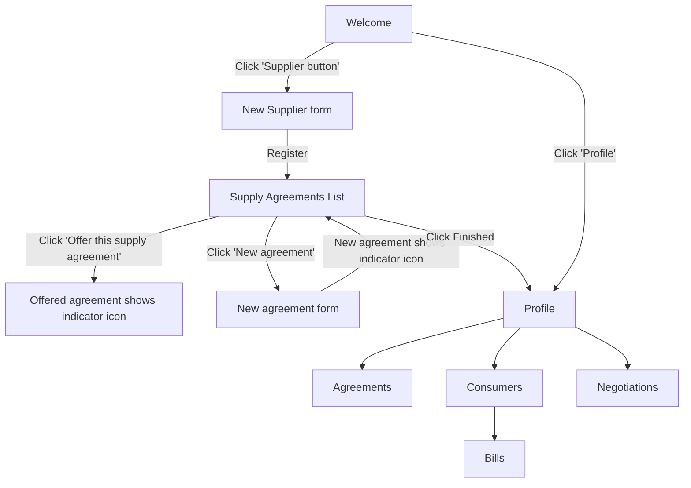
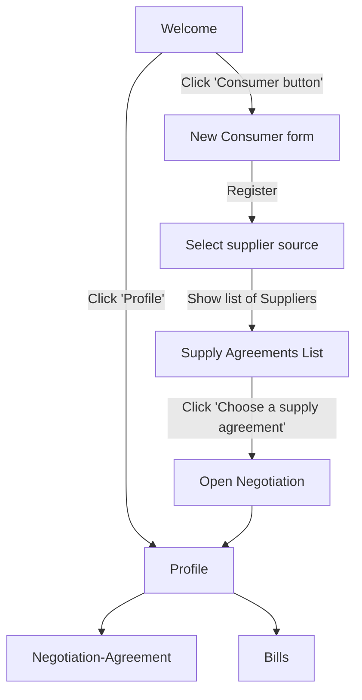

# Supplier experience

```mermaid
flowchart TD
    A[Welcome] --> |Click 'Supplier button'| B[New Supplier form]
    B --> |Register| C[Supply Agreements List]
    C --> |Click 'Offer this supply agreement'| D[Offered agreement shows indicator icon]
    C --> |Click 'New agreement'| E[New agreement form]
    E --> |New agreement shows indicator icon| C
    C --> |Click Finished| G
    A --> |Click 'Profile'| G[Profile]
    G --> H[Agreements]
    G --> I[Consumers]
    I --> K[Bills]
    G --> J[Negotiations]
```

# Consumer experience

```mermaid
flowchart TD
    A[Welcome] --> |Click 'Consumer button'| B[New Consumer form]
    B --> |Register| C[Select supplier source]
    C --> |Show list of Suppliers| D[Supply Agreements List]
    D --> |Click 'Choose a supply agreement'| E[Open Negotiation]
    A --> |Click 'Profile'| G[Profile]
    G --> J[Negotiation-Agreement]
    G --> K[Bills]
    E --> G
```