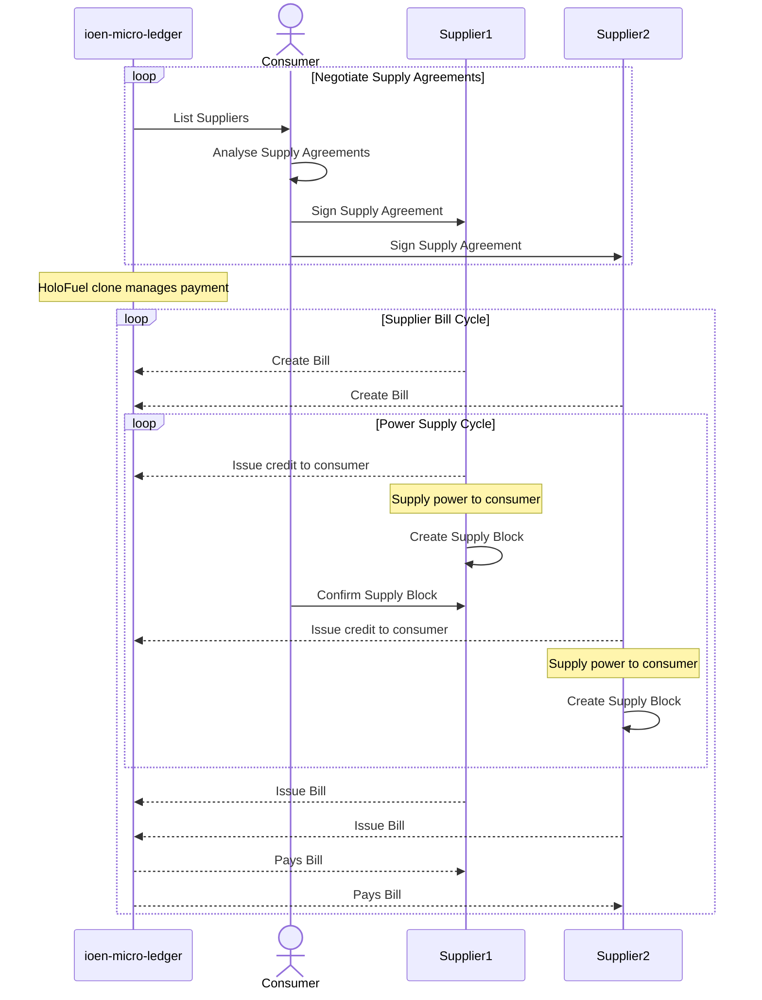
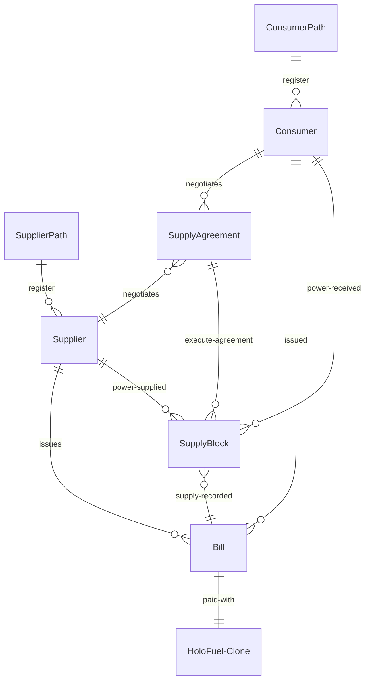
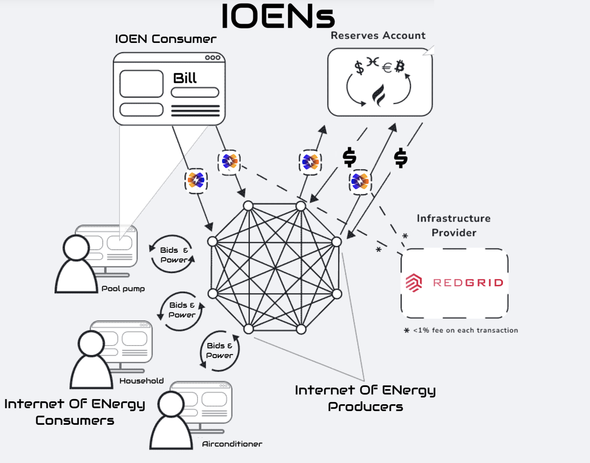

# Specification for ioen-micro-ledger

## Description

The ioen-micro-ledger enables Suppliers and Consumers of electricity to trade IOENs via a distributed Supply Agreement System where each micro grid can have its own set of agreements. Suppliers and Consumers of power can then negotiate a Supply Agreement that is tailored for them and referenced for billing as power is supplied.

Scenario 1: A Consumer has agreements with 3 homes on their street and the battery for the street over. The Consumer needs 4 kWh and is supplied 1 kWh from each.

Scenario 2: When a Consumer needs 1 kWh it will come from first available preference.

The power distribution bus manages the power connections. The ioen-micro-ledger is logging that power was supplied not deciding who should be the supplier.

A Consumer can also be a Supplier, such as a typical household with solar power and a battery, but can only be one or the other during a Supply Block. This is because it is assumed if a Consumer is producing power that is the best value power they can consume. If they are producing more power then they are consuming then they can be a Supplier for that Supply Block.

### Sequence of events

> MVP of ioen-micro-ledger will implement the solid lines in the sequence diagram
> Quality of service metrics added to Supply Block used for reputation

### Registering

When a supplier registers to be part of the Internet Of ENergy their method of producing power and post code are recorded in their Profile along with their name & address. Consumers can then choose which power sources they are happy to consume from locally available suppliers.

eg: A solar Supplier in post code 3149 would be linked to the Path "Supplier.solar.3149" in Holochain.

When a Consumer registers, the generation methods they wish to consume are stored in their Profile along with their name & address.

eg: A Consumer Profile in post code 3149 would be linked to the Path "Consumer.3149" in Holochain.

Available post codes will be assigned each cycle and Suppliers in those post codes will be available for bidding.

If you have already registered as either a Consumer or Supplier and register again the form will be auto filled with the previous entries.

### Billing -> HoloFuel clone

A Consumer who buys power from one or more Suppliers during a billing cycle will be issued a Bill by each Supplier.

IOEN Fuel is the mutual credit currency used to pay for energy generated by a distributed network of energy suppliers who provide electrical power.

