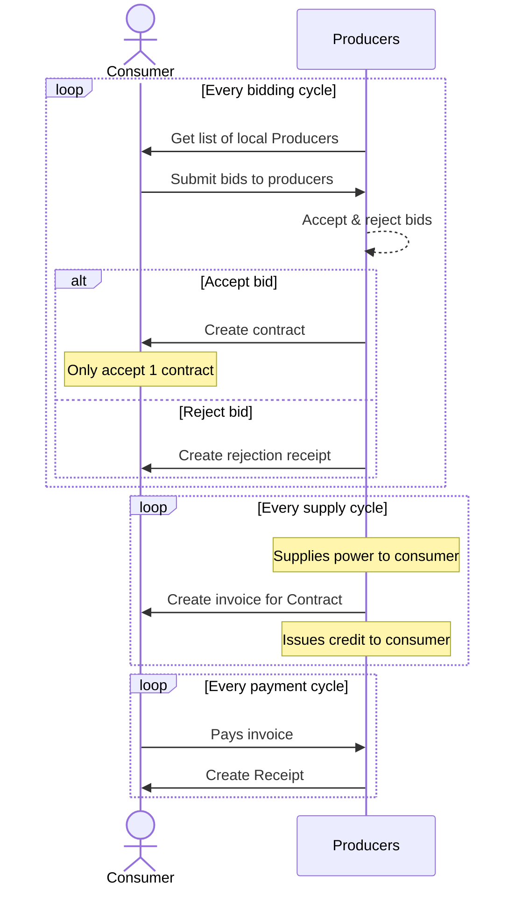
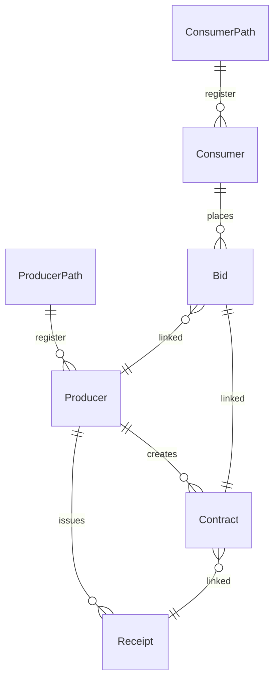

# Specification for ioen-micro-ledger

## Description

The ioen-ledger is the most basic component in the IOEN architecture. The ledger enables Producers and Consumers of electricity to trade via a bidding system. During each cycle consumers place bids on how much they are willing to pay for power and Producers accept bids for as many Consumers as they have capacity for, provide the power and send receipts to acknowledge the sale of power. A Consumer can also be a Producer, such as a typical household with solar power, but can only be one or the other during a cycle. This is because it is assumed if a Consumer is producing power that is the best value power they can consume. If they are producing more power then they are consuming then they can be a Producer for that cycle.

### Registering

When a producer registers to be part of the IOEN their method of producing power and post code are recorded. Consumers can then choose which power sources they are happy to consume from locally available producers.

eg: A solar Producer in post code 3149 would be linked to the Path "Producer.solar.3149" in Holochain.

When a Consumer registers they choose which power sources they wish to consume. Available post codes will be assigned each cycle and Producers in those post codes will be available for bidding.

### Bidding

At the beginning of each cycle a Consumer can submit a bid to each of their local producers. When their bid is accepted they can see which producer supplied their power. Allowing the Consumer to set different bids for each provider such as higher prices for solar than coal will create a market force towards cleaner energy.
Bids can be accepted by a Producer at any time during the cycle, for this first iteration bids will be manually accepted or rejected via the app. Producers will be able to see the bids from each consumer and click accept or reject on each one.
