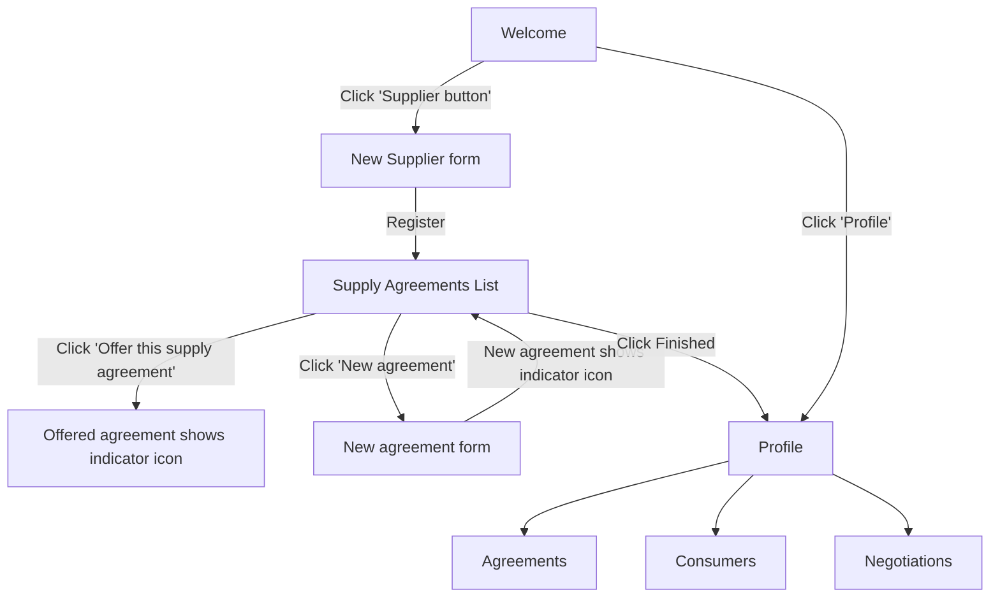

# Supplier experience

```mermaid
flowchart TD
    A[Welcome] --> |Click 'Supplier button'| B[New Supplier form]
    B --> |Register| C[Supply Agreements List]
    C --> |Click 'Offer this supply agreement'| D[Offered agreement shows indicator icon]
    C --> |Click 'New agreement'| E[New agreement form]
    E --> |New agreement shows indicator icon| C
    C --> |Click Finished| G
    A --> |Click 'Profile'| G[Profile]
    G --> H[Agreements]
    G --> I[Consumers]
    G --> J[Negotiations]
```
